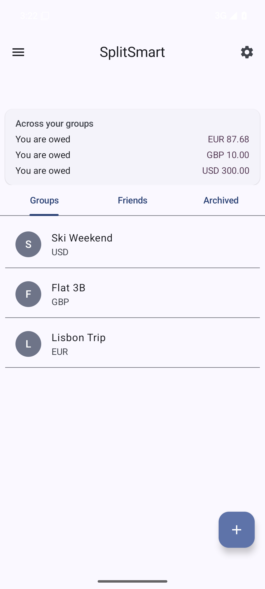
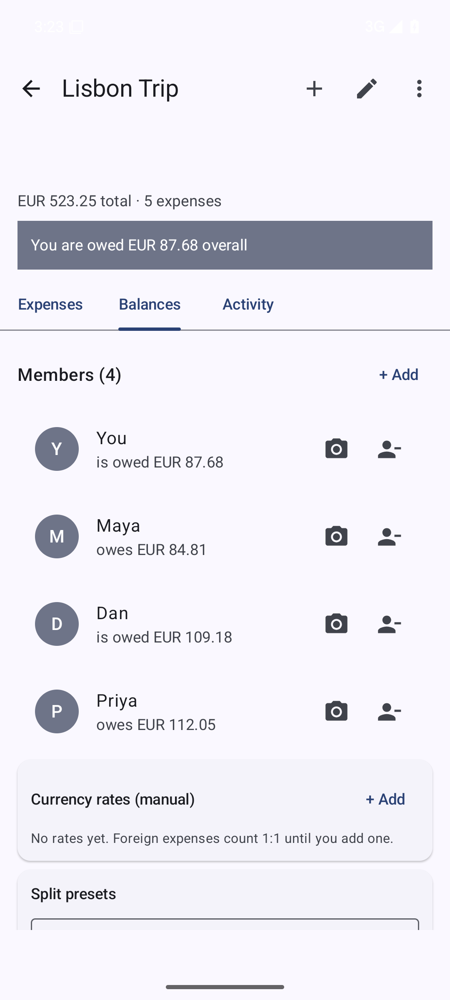
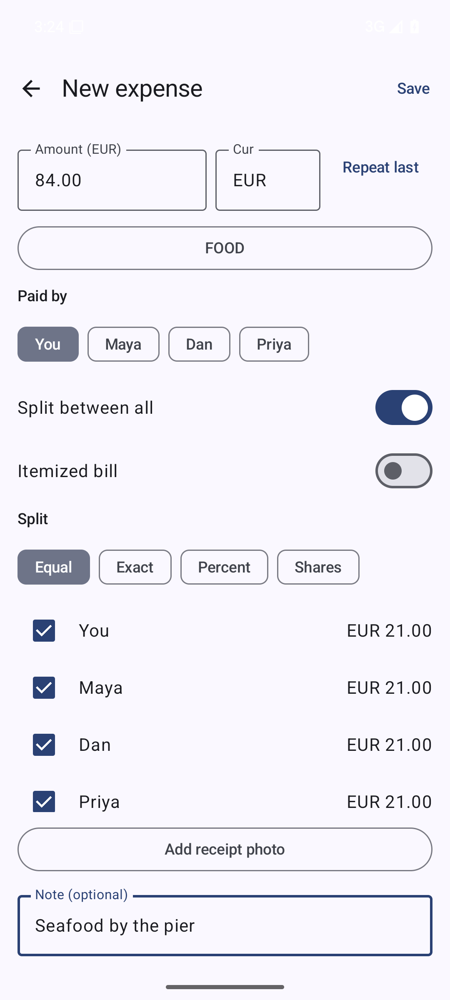
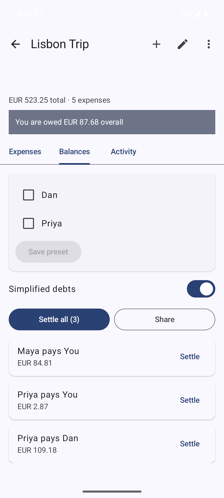

<div align="center">
  
  <h1>SplitSmart</h1>
  <p><strong>Offline-first expense splitting for Android.</strong><br>
  Create groups, record expenses with equal, exact, percent, or shares splits,<br>
  then settle up with the fewest possible transfers.</p>
  <p>
    
    
    
    
  </p>
  <p>
    <a href="https://github.com/RoyCoding8/SplitSmart/releases/tag/v1.0.1"></a>
    &nbsp;&nbsp;
    <a href="https://github.com/RoyCoding8/SplitSmart/releases">All releases</a>
    &nbsp;&nbsp;
    <a href="https://github.com/RoyCoding8/SplitSmart/issues/new?labels=bug">Report a bug</a>
    &nbsp;&nbsp;
    <a href="PUBLISHING.md">Publishing guide</a>
  </p>
</div>

---

## Why

Sharing a bill should not require creating an account, handing over an email
address, or trusting a stranger with your spending history. SplitSmart keeps
every group, expense, and settlement on the device and declares no internet
permission at all. The network is not an option the app can take.

## Features

<p align="center">
  
  
  
  
  
  
</p>

<table>
<tr><td width="50%"><strong>Per-group currency and identity</strong><br>Each group carries its own currency and its own notion of which member is you, so a EUR trip and a GBP flat share never mix.</td>
<td width="50%"><strong>Four split modes</strong><br>Equal, exact amounts, percentage, and shares, each with a participant subset and a live preview before you commit.</td></tr>
<tr><td><strong>Fewest-transfer settlement</strong><br>A debt plan nets every balance first, then finds a small set of transfers to clear it. A raw ledger view is one tap away when you want the unoptimized list.</td>
<td><strong>Recurring templates</strong><br>Bills generate their own due expenses on a background worker, with duplicate protection and bounded catch-up for a phone that was off.</td></tr>
<tr><td><strong>Reminders for bills and settle-ups</strong><br>A background worker posts a notification for due bills, and can nudge people who owe you. Both switches are in Settings.</td>
<td><strong>Material 3 throughout</strong><br>Dynamic color, dark mode, a home-screen balance widget, and app shortcuts.</td></tr>
</table>

Also included: per-group CSV export, JSON backup and restore that preserves group
colour, custom categories, receipt photos and the "you" identity, partial and full
settlements, history search, and category filters.

<h3>Multi-currency without a rate API</h3>

<p>You enter the exchange rate yourself. SplitSmart has no network access to fetch
one, so it never silently converts at today's rate. A rate is stamped with the moment
you saved it, and a foreign-currency settlement is converted using the rate in effect
at the expense's own date. If no rate covers an expense, the conversion falls back to
1:1 rather than failing, so check the rate list for a group before settling it in a
foreign currency.</p>

## Screenshots

| | | |
|:--:|:--:|:--:|
|  |  |  |
| Groups | Balances | Split editor |
|  | | |
| Settle up | | |

## Privacy

The app declares no `INTERNET` permission. There is no analytics SDK, no
crash reporter, and no telemetry of any kind. Your data leaves the device only
when you explicitly export it to a file you choose. See
[PRIVACY.md](PRIVACY.md).

## Architecture

Single `:app` module. MVVM with a repository layer, Hilt for injection, Room for
storage. Compose screens talk to ViewModels that expose a `StateFlow`, which call
`SplitRepository` for suspend reads and Flow updates. The home screen models its
three group lists and the dashboard as a sealed `Load` type so a failure can render
as a message; the other screens expose the plain value and start empty.

The split and settlement logic is pure Kotlin with no Android dependency, which
is what makes it testable without a device. Settlement uses a subset-sum search for
each zero-sum group and falls back to a greedy pass when a group has more than
fifteen participants. Splits use largest-remainder allocation. Money is stored as
`Long` minor units end to end, and shares always sum exactly to the expense total,
so no rounding drift accumulates across a group.

## Build

Requires JDK 17 and the Android SDK (platform 35, build-tools 35). Set
`ANDROID_HOME`, or put `sdk.dir` in `local.properties`.

```sh
./gradlew :app:assembleDebug      # APK at app/build/outputs/apk/debug/
./gradlew :app:testDebugUnitTest  # full unit suite, must be green
```

Release builds read their signing properties from the environment
(`SPLITSMART_STORE_FILE`, `SPLITSMART_STORE_PASSWORD`, `SPLITSMART_KEY_ALIAS`,
`SPLITSMART_KEY_PASSWORD`). Without them the release build type is unsigned,
which is exactly what F-Droid wants. See [PUBLISHING.md](PUBLISHING.md) for
release and submission details.

## Contributing

Conventional commits (`feat:`, `fix:`, `chore:`). For changes under `core.*`,
write the failing test first, and never weaken a test to make it pass. The
gate for every change is a green `testDebugUnitTest`.

## License

Apache 2.0. See [LICENSE](LICENSE).
